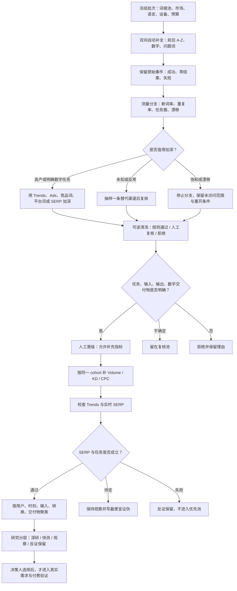

# 词根查词流程与筛选标准

这份说明既可供人阅读，也可供 Skill 执行。目标是从一组版本化词根形成“值得继续研究的产品机会族”，不是直接决定做什么产品。

## 一张图看完整流程

可直接分享的矢量版见 [`../assets/root-keyword-workflow.svg`](../assets/root-keyword-workflow.svg)。

## 第一层：词根和采集范围

| 检查项 | 通过 | 复核 | 拒绝或另开批次 |
|---|---|---|---|
| 词根来源 | 来自本轮冻结、版本化词根池 | 新发现的自然子词根，有父级证据 | 论坛、榜单、旧候选等被偷偷塞进 root-first 批次 |
| 市场上下文 | 国家、语言、设备、日期明确 | 个别字段暂缺，但已标记 | 把 Global、US、移动端、桌面端混为一体 |
| 扩展覆盖 | 前后 A–Z、数字、问题词均有记录 | 预算部分完成，剩余队列保留 | 预算耗尽却写成“全部完成” |
| 原始证据 | 成功、零结果和失败都保存 | 暂时无法重试的失败 | 只保存最后去重文本，丢失来源和失败事件 |

### 分支加深判断

优先加深：

- 新词率高，且出现多个实质不同的用户任务；
- 分支不宽，但输入、输出和数字交付物非常明确；
- 出现与已有假设冲突的反常证据，值得低成本抽样；
- 某个渠道能回答当前明确的未知问题。

优先停止或持有：

- 连续两个观察窗口没有新增实质任务簇；
- 家族重复率超过约 90%；
- 导航、品牌、残句或无关噪声超过约 60%；
- 分支已经语义漂移；
- 达到成本或安全上限。

这些比例是初始控制值，不是永久真理。每次必须保存分子、分母、窗口大小、未访问范围和重开条件。

## 第二层：语义晋级硬标准

一个词只有五项都明确，才可进入指标补充。

| 字段 | 必须回答的问题 | 合格示例 |
|---|---|---|
| `task_type` | 用户究竟要完成什么动作？ | 从 PDF 中抽取表格 |
| `input` | 用户交给工具什么？ | 一份含表格的 PDF |
| `output` | 系统做完后产生什么？ | 结构化表格数据 |
| `digital_deliverable` | 用户最终能拿走或继续使用什么？ | 可下载的 CSV/XLSX |
| `disposition` | 人工是否明确同意进入下一层？ | `promoted` |

### 直接留在复核或拒绝池的常见类型

- 只表达浏览、导航、评测、教程或“哪里买”；
- 需要线下服务、物理维修、工业零件或人工到场；
- 游戏搭建、游戏内容或攻略，但没有明确可复用数字交付物；
- 单纯品牌词、人物词、型号词；
- 残缺短语、含义未知、可能涉及多个完全不同任务；
- 只有“生成器、转换器、计算器”等动作词，但输入输出说不清。

不要把这些类型永久封死。若能用真实 SERP 或用户任务证据补齐五项，可以重新复核。

## 第三层：指标筛选标准

指标只用于比较搜索获客线索，必须在相同的市场、语言、设备、数据源、匹配类型和检查日期内比较。

### 必做的三张独立排序

1. Volume 从高到低；
2. KD 从低到高；
3. CPC 从高到低。

不要先做一个“总分”覆盖这三种观察。缺失是缺失，0 是真实观测值，二者不能互换。

### 可选的历史兼容窗口

| 场景 | 核心区 | 20% 邻界复核区 |
|---|---|---|
| 规模观察 | Volume ≥ 30,000；KD ≤ 60；CPC ≥ 0.01 | Volume 24,000–<30,000；KD >60–72；CPC 0.008–<0.01 |
| 新站观察 | KD ≤ 29；CPC ≥ 0.10 | KD >29–34.8；CPC 0.08–<0.10 |

这些是历史比较窗口，不是产品选择门槛。KGR 只在 Volume ≤ 250 且有 `intitle` 数据时计算；`Volume × CPC ÷ max(KD,1)` 只能作为获客启发式。两者都不能证明需求或付费。

## 第四层：Trends 与实时 SERP

| 检查项 | `pass` | `hold` | `fail` |
|---|---|---|---|
| 搜索意图 | 结果页主要服务于同一明确任务 | 意图混合或市场上下文不足 | 主导意图与拟议任务不同 |
| 页面形态 | 存在适合目标产品形态的结果与缺口 | 供给不明或样本不足 | 被强品牌、官方答案或成熟免费工具完全覆盖 |
| 任务闭环 | 输入、转换、输出、交付物均能在结果页得到支持 | 一项仍是假设 | 搜索者只想浏览、导航或购买实体物品 |
| 上下文 | 市场、语言、设备、搜索类型、日期齐全 | 有字段待补 | 用不匹配市场或设备替代结论 |

负面 SERP 是有价值的反证，必须保留。Trends 的 0–100 只在同一比较组、地区、时间窗和搜索类型内有意义。

## 第五层：产品机会族筛选

按“同一用户 + 同一时刻 + 同一输入 + 同一转换 + 同一交付物”聚类。不同拼写、长尾和同义词通常属于一个产品族；OCR、转录、转换、切分等完成任务不同，通常不应硬并。

| 层级 | 进入条件 | 下一步 |
|---|---|---|
| `deep_research` | 任务与交付物明确，且已有足够搜索或市场证据支持更昂贵研究 | 查真实问题、竞品缺口、实现与付费证据 |
| `quick_test` | 任务明确、可低成本证伪，但需求、供给或实现仍有关键未知 | 设计最便宜的反证测试 |
| `observe` | 任务合理，但发现或证据仍不足 | 指定缺失证据与重开条件 |
| `counterevidence_hold` | 当前反证不支持继续投入 | 保留记录，不放入活跃优先池 |

每个产品族必须同时保留：最强支持、最强反证、实现形态、难度、致命风险、缺失证据和最便宜证伪方式。

## 不能跨越的结论边界

- 自动补全词 ≠ 搜索量；
- 搜索量 ≠ 重复性痛点；
- CPC ≠ 用户愿意为你的产品付费；
- 低 KD ≠ 值得做；
- 趋势上升 ≠ 可持续需求；
- SERP 有缺口 ≠ 产品已验证；
- 研究优先级 ≠ 选择许可、验证许可或开发许可。

最终选择必须由决策人明确作出；真实需求和付费需要单独验证。
